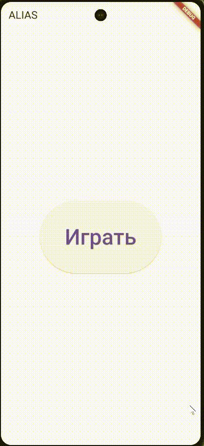

# alias_game
Проект представляет собой приложение, реализующее популярную настольную игру Alias. 

## Функционал 
1. Есть возможность добавлять любое количество команд и редактировать их наименования.
2. Можно выбрать количество раундов, которые будут сыграны.
3. В каждом раунде для команды генерируется случайным образом карточка из 10 слов, которые нужно успеть объяснить за 1.5 минуты. Отгаданные слова отмечаются, можно сразу отслеживать количество текущих очков. Есть возможность досрочно закончить раунд.
4. После окончания всех раундов появляется страница с результатами игры. Есть возможность досрочно завершить игру в конце каждого рануда для любой команды.

## Демонстрация работы приложения

