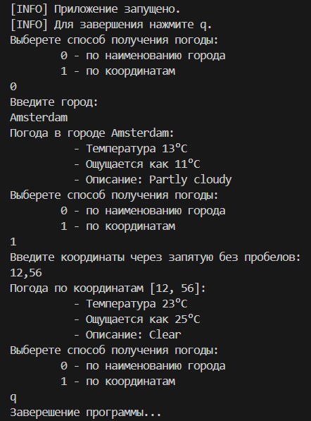

# Описание
## Используемое API
-> <a href="https://www.weatherapi.com/docs/#intro-request">WeatherAPI</a> <-

## Запуск
Находясь в директории __practice_1__ выполнить команду: `dart run .\bin\practice_1.dart`.

